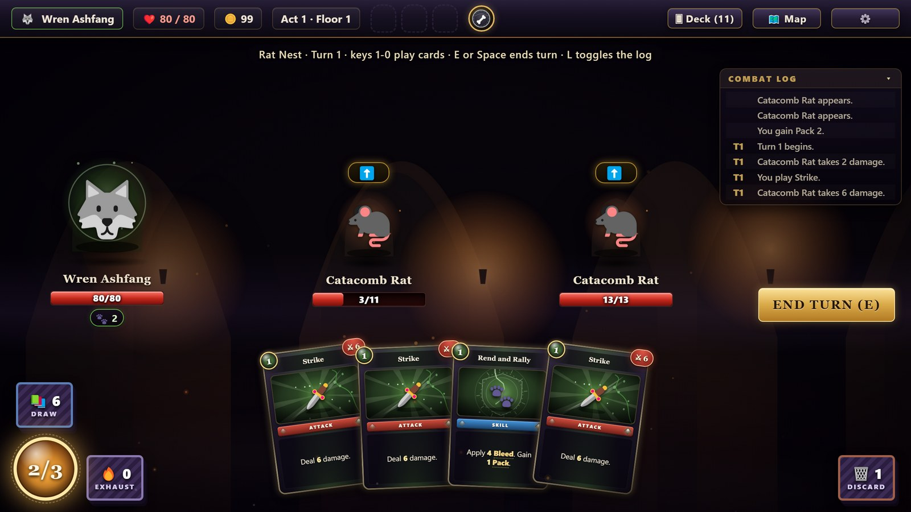
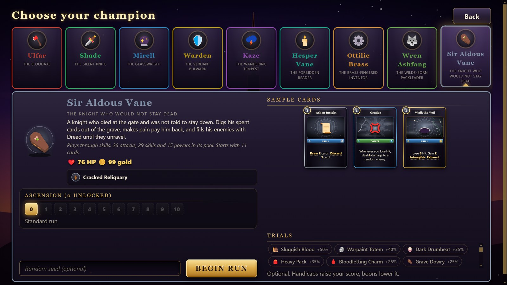
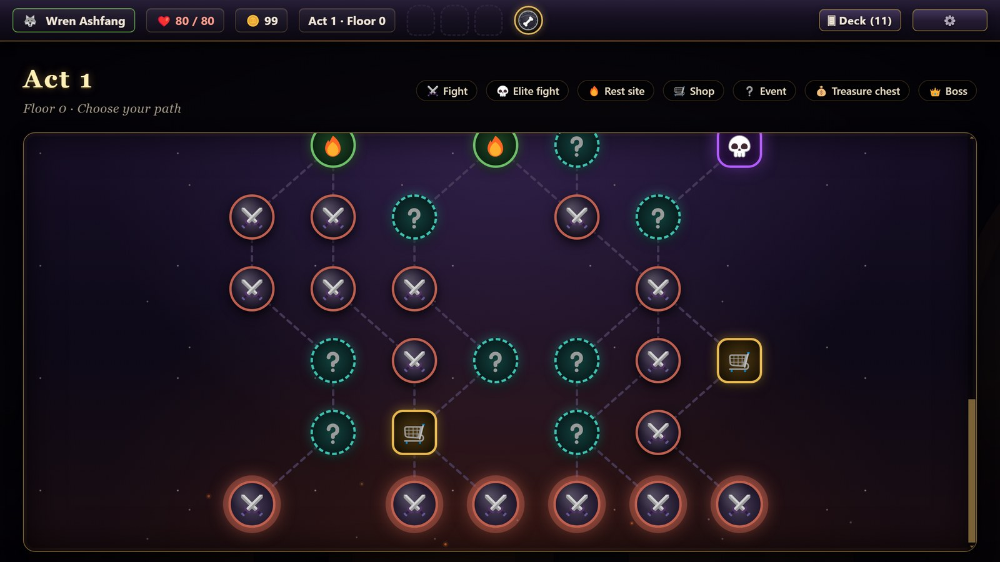
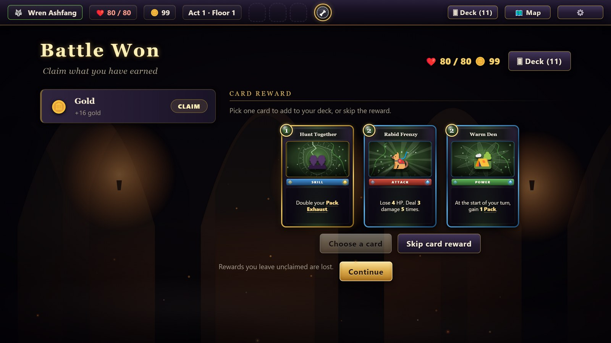
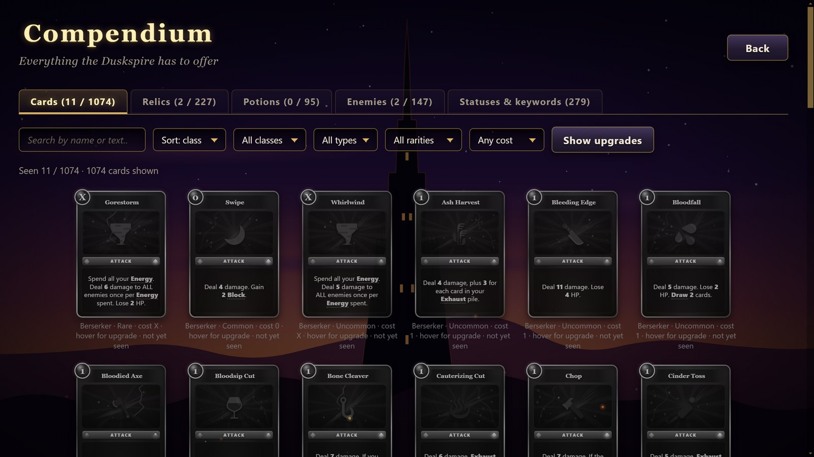

<h1 align="center">Duskspire</h1>

<p align="center"><em>Forge a deck. Climb the spire.</em></p>

<p align="center">
  <a href="https://subterfugus.github.io/duskspire/"><strong>▶ Play in your browser</strong></a>
  &nbsp;·&nbsp; <a href="docs/GUIDE.md">Player guide</a>
  &nbsp;·&nbsp; <a href="docs/MODDING.md">Modding</a>
  &nbsp;·&nbsp; <a href="docs/DEVLOG.md">Dev log</a>
</p>

<p align="center"></p>

Duskspire is a single-player roguelike deckbuilder in the style of Slay the Spire. You pick a champion, build a deck
as you go, and fight your way through three acts of branching maps. Each act ends in a boss. Beating the third boss
wins the run, and a run that ends early still counts toward your score.

It is plain JavaScript with no build step and no runtime dependencies. All art is drawn procedurally as SVG and all
sound is synthesized in the browser, so the repository ships no image or audio assets. It was written almost entirely
by AI agents; see [How this was made](#how-this-was-made).

## What's in it

| | |
|---|---|
| Champions | 9, each with its own card class, starter relic and archetypes |
| Cards | 1,074 |
| Relics | 227, including 24 Trials |
| Potions | 95 |
| Enemies | 147, in 183 encounters across three acts |
| Events | 84 |

- **Three acts.** Each is a branching map of fights, elite fights, shops, rest sites, events and treasure rooms, ending
  in a boss and a boss relic choice.
- **Readable combat.** Energy, block, enemy intents shown a turn ahead, statuses, potions and relics. Cards show the
  damage or block they will do right now.
- **Ascension 1 to 10**, unlocked per champion by winning.
- **Trials.** Optional run modifiers chosen before a run. Handicaps raise your score and boons lower it.
- **Seeded runs.** The same champion, seed and ascension give the same map and rewards.
- **Saves** that resume in the exact room you left. A fight you quit mid-way restarts from its first turn with the same
  enemies and opening hand.
- **Run history, achievements, a searchable compendium** and a how-to-play screen with a glossary.
- **Settings** for game speed, volume, music, end-turn confirmation, screen shake, the combat log and fullscreen.

## The champions

| Champion | Class | Plays around |
|---|---|---|
| Ulfar, the Bloodaxe | Berserker | Strength, multi-hit attacks and paying HP for power |
| Shade, the Silent Knife | Shade | Poison, cheap Shivs and fast deck cycling |
| Mirell, the Glasswright | Arcanist | Arcane Charge, Burn and Frost |
| Warden, the Verdant Bulwark | Warden | Block, thorns, and turning Block into damage |
| Kaze, the Wandering Tempest | Tempest | Momentum built over a turn and spent on Finishers |
| Hesper Vane, the Forbidden Reader | Occultist | Hexes, feeding on her own curses, and rituals that grow each turn |
| Ottilie Brass, the Brass-Fingered Inventor | Artificer | Turret constructs and scrapping cards for payoffs |
| Wren Ashfang, the Wilds-Born Packleader | Beastcaller | A growing Pack, Bleed, and fighting at low HP |
| Sir Aldous Vane, the Knight Who Would Not Stay Dead | Revenant | Returning cards from the grave, and Dread |

<p align="center">
  
  
</p>
<p align="center">
  
  
</p>

## Running it

The quickest way is the [browser version](https://subterfugus.github.io/duskspire/). To run it locally, pick one of
these. All three need Node.js.

1. **Browser, no install.** `node tools/serve.js`, then open http://localhost:8123. Set the `PORT` environment variable
   to use another port. The server uses only Node's built-in modules.
2. **Desktop window.** `npm install`, then `npm start`. This opens the game in Electron, which is the only development
   dependency.
3. **Windows shortcut.** Double-click `run.bat`. It runs `npm install` if needed, then `npm start`.

## Controls

Click a card to play it, or drag it onto its target. Click an enemy to pick it as the target. Click a potion in the
top bar to use it. Hover over cards, enemy intents, statuses and relics to read what they do.

| Key | Action |
|---|---|
| 1 to 9, 0 | Play the card in that hand position. |
| E or Space | End your turn. |
| Arrow keys | Move the target while choosing one. |
| Enter or Space | Confirm the target. |
| Esc | Cancel a card you are targeting, or close the top dialog. |
| L | Show or hide the combat log. |
| F11 | Toggle fullscreen in the desktop window. |

## Project layout

```
index.html          page shell and the script load order
styles.css          all styling
main.js             Electron main process: one window that loads index.html
run.bat             Windows launcher
CONTRACT.md         the shared build contract: names, data shapes, id prefixes, load order
docs/               player guide, modding guide, development log, screenshots
src/engine/         core.js (registries, events, helpers), statuses.js, combat.js, run.js (run, map, rewards, save)
src/content/        data files: cards, relics, potions, enemies, encounters, events, trials
src/ui/             kit.js, art.js, audio.js, fx.js, screens.js, combat_ui.js, boot.js
tools/              static server, validators, tests and the balance bot
tools/workflows/    the orchestration scripts that split the build across agents
```

Every file in `src/` is a classic script that attaches to one global, `globalThis.DS`. Content is declarative: a card
is a data object whose effects are a short list of operations such as `damage`, `block`, `apply` and `draw`. See
[docs/MODDING.md](docs/MODDING.md) to add your own.

## Checks

Run these from the project root.

```
node tools/smoke.js               validate every content file and run bot fights
node tools/tests.js               run the engine unit tests
node tools/content_tests.js       play every card, potion, relic, encounter and event once
node tools/balance.js --runs=20   play full runs with a heuristic bot and print win rates per champion
```

- `smoke.js` checks each definition's shape and id prefix, checks that the script tags in `index.html` match the load
  list, and runs a set of fights and simulated runs. `--quick` skips the full runs. It exits with code 1 on an error.
- `tests.js` runs the engine tests. `--only=text` filters by name and `--list` prints the names.
- `content_tests.js` exercises each piece of content in a real fight and compares simple card text with the effect.
- `balance.js` is a rule-following bot, not a human player. Its win rates are a rough relative guide. Options:
  `--char=id`, `--asc=N`, `--runs=N`.

## Known gaps

- Balance is tuned against the bot, which plays defensively. Its win rates range from about 15% to 55% by champion.
- The newest content (Artificer, Beastcaller, Revenant, the third card sets, Trials) has had less play than the rest.
- The desktop window has been checked less than the browser version.
- Audio has not been judged by ear.

## How this was made

Duskspire was built over two days as an experiment in multi-agent development. A lead Claude session wrote a shared
contract, [CONTRACT.md](CONTRACT.md), fixing names, data shapes, id prefixes and the script load order. Subagents
running Claude Haiku 5.5 then each wrote a small set of files against it, about 20 at a time. Sonnet 5.5 agents did
the design passes and wrote the Beastcaller and Revenant classes, and the lead session did integration, polish and
balance. The orchestration scripts are in [tools/workflows/](tools/workflows/), and
[docs/DEVLOG.md](docs/DEVLOG.md) records what worked, what went wrong and what was dropped.

## Licence

No licence has been chosen yet, so all rights are reserved by default.
